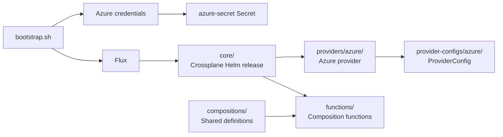

# Azure Crossplane Demo

Demo environment for managing Azure resources with Crossplane

> [!CAUTION]
> This repository is for demonstrations and workshops only. Do not use it in
> production. It grants broad Azure permissions, stores credentials locally,
> and does not provide the security, reliability, or operational hardening
> required for a production environment.

Crossplane is installed through Flux from [`clusters/dev/crossplane/`](clusters/dev/crossplane/):



- [`core/`](clusters/dev/crossplane/core/) installs Crossplane through Helm.
- [`providers/azure/`](clusters/dev/crossplane/providers/azure/) installs the Azure provider package.
- [`provider-configs/azure/`](clusters/dev/crossplane/provider-configs/azure/) configures the provider with Azure credentials.
- [`functions/`](clusters/dev/crossplane/functions/) installs the packages used by Compositions.
- [`flux-kustomizations/`](clusters/dev/crossplane/flux-kustomizations/) defines the dependency order, so each stage starts only after its required CRDs are ready.
- [`infrastructure/bootstrap.sh`](infrastructure/bootstrap.sh) creates the Kubernetes `Secret` from a locally generated service principal before bootstrapping Flux.
- Full convergence takes a minute or two after bootstrap. Watch it with `flux get kustomizations -A`.

> [!NOTE]
> Crossplane `CompositeResourceDefinition`s and `Composition`s live in the
> shared, top-level [`compositions/`](compositions/) directory, outside
> `clusters/dev/`. They are grouped first by cloud provider and then by
> composition, allowing multiple clusters to use the same definitions.
> [`compositions/azure/resourcegroup/`](compositions/azure/resourcegroup/) is a
> working example: an `XResourceGroup` in the `azure.platform.example.org` API
> group composing an Azure `ResourceGroup`.

## Configuring the local Kubernetes cluster (kiac) + Azure access (for Crossplane)

[kiac](https://github.com/saiyam1814/kiac) runs a local Kubernetes cluster on macOS, with every node as its own lightweight VM. [`infrastructure/config.yaml`](infrastructure/config.yaml) declares a 3-worker cluster with the observability (Prometheus + Grafana) and gateway (Traefik) addons enabled.

### Prerequisites

- Apple silicon Mac on macOS 26+
- [Homebrew](https://brew.sh)
- GitHub CLI: `brew install gh`
- Flux CLI: `brew install fluxcd/tap/flux`
- Azure CLI: `brew install azure-cli`
- Jq: `brew install jq`
- An Azure account with permission to create a service principal and assign it a role on your subscription

### Steps

1. Authenticate the GitHub CLI (needed to fork the repo and to generate a token later):

   ```sh
   gh auth login
   ```

2. Fork and clone the repo to your own account, then `cd` into it — you won't have push access to the original:

   ```sh
   gh repo fork sjovang/azure-crossplane-demo --clone=true
   cd azure-crossplane-demo
   ```

3. Install the `container` CLI and start its system service:

   ```sh
   brew install container
   container system start
   ```

4. Install `kiac`:

   ```sh
   brew install --cask saiyam1814/tap/kiac
   ```

5. Verify your setup:

   ```sh
   kiac doctor
   ```

6. Log in to Azure (needed so `bootstrap.sh` can create the service principal Crossplane uses):

   ```sh
   az login
   ```

7. Export a token, then create the cluster, set up Azure credentials for Crossplane, and bootstrap [Flux](https://fluxcd.io) against your fork:

   ```sh
   export GITHUB_TOKEN=$(gh auth token)
   ./infrastructure/bootstrap.sh
   ```

   The script creates or reuses the Azure service principal, applies its
   credentials as the `azure-secret` Kubernetes `Secret`, and then bootstraps
   Flux. `GITHUB_TOKEN` is required because Flux configures Git access through
   the GitHub API.

   Optional environment variables:

   | Variable | Default | Purpose |
   | --- | --- | --- |
   | `FLUX_OWNER` | GitHub user from `gh` | Repository owner |
   | `FLUX_REPO` | `azure-crossplane-demo` | Repository name |
   | `FLUX_BRANCH` | `main` | Git branch |
   | `FLUX_PATH` | `clusters/dev` | Flux path |
   | `FLUX_PRIVATE` | `true` | Keep the repository private |
   | `SP_NAME` | `azure-crossplane-demo` | Azure service principal name |

   Credentials are stored in the gitignored
   `infrastructure/azure-credentials.json` and reused on later runs.

8. Allow a minute or two for Flux to converge, then verify the cluster and Crossplane:

   ```sh
      kubectl get nodes
      kubectl get providers.pkg.crossplane.io
      kubectl get providerconfigs.azure.upbound.io
      flux get kustomizations -A
   ```

9. When you're done, tear everything down — this deletes both the Azure service principal and the kiac cluster:

   ```sh
   ./infrastructure/teardown.sh
   ```

## Working with Resources

Team resources live in the shared, top-level [`teams/`](teams/) directory, with one subfolder per team:

- Each team folder has its own [`kustomization.yaml`](teams/mvpdagen/kustomization.yaml) listing the manifests it wants to deploy.
- The team Kustomization sets the team's namespace and includes the shared [`teams/_base/`](teams/_base/) Namespace template, so the Namespace is created alongside the team's resources.
- [`teams/kustomization.yaml`](teams/kustomization.yaml) explicitly registers each team directory for Flux; native Kustomize does not infer team directories or Namespace names automatically.
- The `Crossplane Resources` Grafana dashboard shows composite resources, composed Azure resources, conditions, and composition references.

## Developer Portal (Backstage)

> [!NOTE]
> This is a base configuration only: Microsoft Entra ID (Azure AD) OIDC
> sign-in, no catalog integration with Crossplane resources yet, and no
> Ingress/Traefik exposure — access is via `kubectl port-forward`.

Architecture:

- [`clusters/dev/apps/backstage/`](clusters/dev/apps/backstage/) — everything
  Backstage, split into the two team-folder-style subfolders used elsewhere
  in this repo:
  - [`app/`](clusters/dev/apps/backstage/app/) — the Backstage application
    source (a standard `create-app`-style monorepo: `packages/backend`,
    `packages/app`), its `app-config.yaml`/`app-config.production.yaml`,
    and its `Dockerfile`. This is the only application source code in the
    repo — everything else here is declarative manifests.
  - [`infra/`](clusters/dev/apps/backstage/infra/) — the Kubernetes
    `Namespace`, `Deployment`, and `Service` for Backstage, applied by the
    dependent `apps` Flux Kustomization
    (`clusters/dev/apps-kustomization.yaml`, `dependsOn: flux-system`,
    `path: ./clusters/dev/apps/backstage/infra`). Only `infra/` is ever
    applied by Flux — `app/` is not Kubernetes YAML.

### Prerequisites

- Node.js 20 or 22
- A container registry you can push to (e.g. GHCR, Docker Hub, ACR)
- An Azure account with permission to create an Entra ID App Registration

### Steps

1. **Create an Entra ID App Registration** (manual, in the
   [Azure Portal](https://portal.azure.com/#view/Microsoft_AAD_RegisteredApps/ApplicationsListBlade)):

   - Add a **Web** platform redirect URI:
     `http://localhost:7007/api/auth/microsoft/handler/frame` (this base
     config targets `kubectl port-forward`, not an Ingress hostname).
   - Under **API permissions**, add the `Microsoft Graph` delegated
     permissions: `email`, `offline_access`, `openid`, `profile`,
     `User.Read`. Grant admin consent if your tenant requires it.
   - Under **Certificates & secrets**, create a client secret and note its
     value.
   - Note the **Application (client) ID** and **Directory (tenant) ID** from
     the App Registration's Overview page.

2. **Build and push the Backstage image** (from the
   [`clusters/dev/apps/backstage/app/`](clusters/dev/apps/backstage/app/)
   directory):

   ```sh
   cd clusters/dev/apps/backstage/app
   npm install
   docker build -t <your-registry>/backstage:latest .
   docker push <your-registry>/backstage:latest
   ```

   Update the `image:` field in
   [`clusters/dev/apps/backstage/infra/deployment.yaml`](clusters/dev/apps/backstage/infra/deployment.yaml)
   to match the image you pushed.

3. **Create the `backstage-entra-secret` Secret** in the cluster, using the
   values from step 1 (idempotent, like the `azure-secret` created by
   `bootstrap.sh`):

   ```sh
   kubectl create namespace backstage --dry-run=client -o yaml | kubectl apply -f -
   kubectl create secret generic backstage-entra-secret -n backstage \
     --from-literal=clientId=<application-client-id> \
     --from-literal=clientSecret=<client-secret-value> \
     --from-literal=tenantId=<directory-tenant-id> \
     --dry-run=client -o yaml | kubectl apply -f -
   ```

4. **Reconcile Flux and verify**:

   ```sh
   flux reconcile kustomization apps -n flux-system --with-source
   flux get kustomizations -A
   ```

5. **Port-forward and sign in**:

   ```sh
   kubectl port-forward -n backstage svc/backstage 7007:7007
   ```

   Open `http://localhost:7007` and confirm you're redirected to Entra ID
   and back after signing in.

## Troubleshooting

For a resource that does not appear in Azure, check the deployment chain from Flux to Crossplane:

1. Check Flux reconciliation:

   ```sh
   flux get kustomizations -A
   flux logs --kind Kustomization --name teams --namespace flux-system
   ```

2. Check the team's composite resource and recent events:

   ```sh
   kubectl get xresourcegroups.azure.platform.example.org -A
   kubectl describe xresourcegroup.azure.platform.example.org/mvpdagen-app -n mvpdagen
   kubectl get events -n mvpdagen --sort-by=.lastTimestamp
   ```

3. Check the composed Azure resource:

   ```sh
   kubectl get resourcegroups.azure.m.upbound.io -A
   kubectl describe resourcegroup.azure.m.upbound.io -n mvpdagen
   ```

After changing a team manifest, trigger reconciliation with:

```sh
flux reconcile kustomization teams -n flux-system --with-source
```
