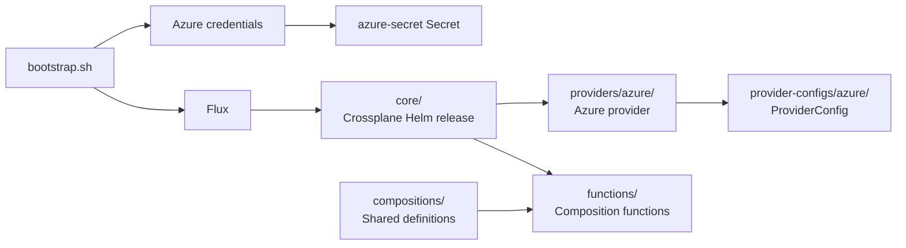

# Azure Crossplane Demo

Demo environment for managing Azure resources with Crossplane

> [!CAUTION]
> This repository is for demonstrations and workshops only. Do not use it in
> production. It grants broad Azure permissions, stores credentials locally,
> and does not provide the security, reliability, or operational hardening
> required for a production environment.

Crossplane is installed through Flux from [`clusters/dev/crossplane/`](clusters/dev/crossplane/):



- [`core/`](clusters/dev/crossplane/core/) installs Crossplane through Helm.
- [`providers/azure/`](clusters/dev/crossplane/providers/azure/) installs the Azure provider package.
- [`provider-configs/azure/`](clusters/dev/crossplane/provider-configs/azure/) configures the provider with Azure credentials.
- [`functions/`](clusters/dev/crossplane/functions/) installs the packages used by Compositions.
- [`flux-kustomizations/`](clusters/dev/crossplane/flux-kustomizations/) defines the dependency order, so each stage starts only after its required CRDs are ready.
- [`infrastructure/bootstrap.sh`](infrastructure/bootstrap.sh) creates the Kubernetes `Secret` from a locally generated service principal before bootstrapping Flux.
- Full convergence takes a minute or two after bootstrap. Watch it with `flux get kustomizations -A`.

> [!NOTE]
> Crossplane `CompositeResourceDefinition`s and `Composition`s live in the
> shared, top-level [`compositions/`](compositions/) directory, outside
> `clusters/dev/`. They are grouped first by cloud provider and then by
> composition, allowing multiple clusters to use the same definitions.
> [`compositions/azure/resourcegroup/`](compositions/azure/resourcegroup/) is a
> working example: an `XResourceGroup` in the `azure.platform.example.org` API
> group composing an Azure `ResourceGroup`.

## Configuring the local Kubernetes cluster (kiac) + Azure access (for Crossplane)

[kiac](https://github.com/saiyam1814/kiac) runs a local Kubernetes cluster on macOS, with every node as its own lightweight VM. [`infrastructure/config.yaml`](infrastructure/config.yaml) declares a 3-worker cluster with the observability (Prometheus + Grafana) and gateway (Traefik) addons enabled.

### Prerequisites

- Apple silicon Mac on macOS 26+
- [Homebrew](https://brew.sh)
- GitHub CLI: `brew install gh`
- Flux CLI: `brew install fluxcd/tap/flux`
- Azure CLI: `brew install azure-cli`
- Jq: `brew install jq`
- An Azure account whose user has the roles below, following the
  principle of least privilege: only what `bootstrap.sh` needs to create
  the Crossplane service principal and the Backstage Entra ID app
  registration, nothing broader (e.g. no Global Administrator/Owner).

  | Role | Scope | Why the bootstrap user needs it |
  | --- | --- | --- |
  | [Application Administrator](https://learn.microsoft.com/en-us/entra/identity/role-based-access-control/permissions-reference#application-administrator) | Microsoft Entra ID tenant | Create/manage both app registrations `bootstrap.sh` creates (`<SP_NAME>-azure-resources`, `<SP_NAME>-backstage`), create their service principals and client secrets, and grant admin consent for the Backstage app's requested Microsoft Graph delegated permissions (`email`, `offline_access`, `openid`, `profile`, `User.Read`) |
  | [Contributor](https://learn.microsoft.com/en-us/azure/role-based-access-control/built-in-roles#contributor) | Azure subscription | Register the `Microsoft.Network` and `Microsoft.Compute` resource providers Crossplane-managed resources depend on |
  | [User Access Administrator](https://learn.microsoft.com/en-us/azure/role-based-access-control/built-in-roles#user-access-administrator) | Azure subscription | Assign the `Contributor` role to the newly created `<SP_NAME>-azure-resources` service principal (`az ad sp create-for-rbac --role Contributor`) |

  > [!NOTE]
  > The `<SP_NAME>-backstage` app registration itself is granted **no**
  > Azure RBAC role — it's used only for user sign-in (OIDC), never to
  > manage Azure resources, so it needs nothing beyond the Microsoft Graph
  > delegated permissions above.

### Steps

1. Authenticate the GitHub CLI (needed to fork the repo and to generate a token later):

   ```sh
   gh auth login
   ```

2. Fork and clone the repo to your own account, then `cd` into it — you won't have push access to the original:

   ```sh
   gh repo fork sjovang/azure-crossplane-demo --clone=true
   cd azure-crossplane-demo
   ```

3. Install the `container` CLI and start its system service:

   ```sh
   brew install container
   container system start
   ```

4. Install `kiac`:

   ```sh
   brew install --cask saiyam1814/tap/kiac
   ```

5. Verify your setup:

   ```sh
   kiac doctor
   ```

6. Log in to Azure (needed so `bootstrap.sh` can create the Crossplane service principal and the Backstage Entra ID app registration):

   ```sh
   az login
   ```

7. Export a token, then create or reuse the cluster, set up Azure credentials for Crossplane and optionally Backstage, and bootstrap [Flux](https://fluxcd.io) against your fork:

   ```sh
   export GITHUB_TOKEN=$(gh auth token)
   ./infrastructure/bootstrap.sh
   ```

   The script prompts if the named kiac cluster already exists, creates or
   reuses the Azure service principal (`<SP_NAME>-azure-resources`), applies
   its credentials as the `azure-secret` Kubernetes `Secret`, and bootstraps
   Flux. When `BACKSTAGE_ENABLED=true`, it also creates or reuses the
   Backstage Entra ID app registration (`<SP_NAME>-backstage`), applies its
   credentials as the `backstage-entra-secret` Kubernetes `Secret`, builds the
   Backstage image and loads it into every cluster node (`container build` +
   `kiac load image` — no container registry involved), configures how
   Backstage is reached (`BACKSTAGE_HOSTNAME`, see below), and points Flux at
   the Backstage-enabled GitOps root. `GITHUB_TOKEN` is required because Flux
   configures Git access through the GitHub API.

   Optional environment variables:

   | Variable | Default | Purpose |
   | --- | --- | --- |
   | `FLUX_OWNER` | GitHub user from `gh` | Repository owner |
   | `FLUX_REPO` | `azure-crossplane-demo` | Repository name |
   | `FLUX_BRANCH` | `main` | Git branch |
   | `FLUX_PATH` | `clusters/dev-with-backstage` when `BACKSTAGE_ENABLED=true`, otherwise `clusters/dev` | Flux path. Override only if you know which GitOps root you want Flux to reconcile |
   | `FLUX_PRIVATE` | `true` | Keep the repository private |
   | `SP_NAME` | `azure-crossplane-demo` | Common prefix for the Azure identities `bootstrap.sh` creates: the Crossplane service principal (`<SP_NAME>-azure-resources`) and the Backstage Entra ID app registration (`<SP_NAME>-backstage`) |
   | `KIAC_EXISTING_CLUSTER_ACTION` | prompt | What to do when the named kiac cluster already exists: `use-existing`, `halt`, or `redeploy` |
   | `BACKSTAGE_ENABLED` | `false` | Set to `true` to build/load and deploy the Backstage developer portal using the Backstage-enabled Flux root. When unset or `false`, all Backstage build and setup steps are skipped |
   | `BACKSTAGE_HOSTNAME` | `backstage.local` | Hostname Backstage is reached at. The default requires one manual, `sudo`-requiring `/etc/hosts` command printed at the end (never run automatically); set it to a domain you control public DNS for instead to avoid touching `/etc/hosts` at all — see [the Backstage README](clusters/dev/apps/backstage/README.md#choosing-how-to-reach-backstage) |

   Credentials are stored in the gitignored
   `infrastructure/azure-credentials.json` and
   `infrastructure/backstage-credentials.json`, and reused on later runs.

8. Allow a minute or two for Flux to converge, then verify the cluster and Crossplane:

   ```sh
      kubectl get nodes
      kubectl get providers.pkg.crossplane.io
      kubectl get providerconfigs.azure.upbound.io
      flux get kustomizations -A
   ```

9. When you're done, tear everything down — this deletes the Backstage Entra ID app registration, the Azure service principal, and the kiac cluster:

   ```sh
   ./infrastructure/teardown.sh
   ```

## Working with Resources

Team resources live in the shared, top-level [`teams/`](teams/) directory, with one subfolder per team:

- Each team folder has its own [`kustomization.yaml`](teams/mvpdagen/kustomization.yaml) listing the manifests it wants to deploy.
- The team Kustomization sets the team's namespace and includes the shared [`teams/_base/`](teams/_base/) Namespace template, so the Namespace is created alongside the team's resources.
- [`teams/kustomization.yaml`](teams/kustomization.yaml) explicitly registers each team directory for Flux; native Kustomize does not infer team directories or Namespace names automatically.
- The `Crossplane Resources` Grafana dashboard shows composite resources, composed Azure resources, conditions, and composition references.

## Developer Portal (Backstage)

A base Backstage configuration with Microsoft Entra ID (Azure AD) OIDC sign-in lives in
[`clusters/dev/apps/backstage/`](clusters/dev/apps/backstage/). With
`BACKSTAGE_ENABLED=true`, `infrastructure/bootstrap.sh` creates the
`<SP_NAME>-backstage` Entra ID app registration and `backstage-entra-secret`,
builds/loads the image (no registry required), and points Flux at
[`clusters/dev-with-backstage/`](clusters/dev-with-backstage/). By default it
uses [`clusters/dev/`](clusters/dev/) and skips the developer portal — see
[its README](clusters/dev/apps/backstage/README.md) for the two ways to reach
Backstage (`BACKSTAGE_HOSTNAME`, above) and troubleshooting.

## Troubleshooting

For a resource that does not appear in Azure, check the deployment chain from Flux to Crossplane:

1. Check Flux reconciliation:

   ```sh
   flux get kustomizations -A
   flux logs --kind Kustomization --name teams --namespace flux-system
   ```

2. Check the team's composite resource and recent events:

   ```sh
   kubectl get xresourcegroups.azure.platform.example.org -A
   kubectl describe xresourcegroup.azure.platform.example.org/mvpdagen-app -n mvpdagen
   kubectl get events -n mvpdagen --sort-by=.lastTimestamp
   ```

3. Check the composed Azure resource:

   ```sh
   kubectl get resourcegroups.azure.m.upbound.io -A
   kubectl describe resourcegroup.azure.m.upbound.io -n mvpdagen
   ```

After changing a team manifest, trigger reconciliation with:

```sh
flux reconcile kustomization teams -n flux-system --with-source
```
