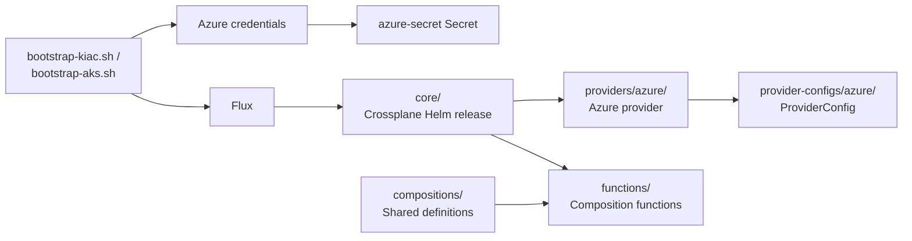

# Azure Crossplane Demo

Demo environment for managing Azure resources with Crossplane

> [!CAUTION]
> This repository is for demonstrations and workshops only. Do not use it in
> production. It grants broad Azure permissions, stores credentials locally,
> and does not provide the security, reliability, or operational hardening
> required for a production environment.

Flux watches [`clusters/local/`](clusters/local/) (a local [kiac](https://github.com/saiyam1814/kiac)
cluster) and [`clusters/aks/`](clusters/aks/) (a real AKS cluster), both of
which include the shared [`clusters/base/`](clusters/base/) Kustomization.
Other demo clusters can use their own overlay with `../base` while keeping
their generated `flux-system/` manifests and bootstrap path separate.
Crossplane is installed from [`clusters/base/crossplane/`](clusters/base/crossplane/):


```mermaid
flowchart LR
   Bootstrap["bootstrap-kiac.sh /<br/>bootstrap-aks.sh"] --> Credentials["Azure credentials"]
   Credentials --> Secret["azure-secret Secret"]
   Bootstrap --> Flux["Flux"]
   Flux --> Core["core/<br/>Crossplane Helm release"]
   Core --> Provider["providers/azure/<br/>Azure provider"]
   Provider --> Config["provider-configs/azure/<br/>ProviderConfig"]
   Core --> Functions["functions/<br/>Composition functions"]
   Compositions["compositions/<br/>Shared definitions"] --> Functions
```

- [`core/`](clusters/base/crossplane/core/) installs Crossplane through Helm.
- [`providers/azure/`](clusters/base/crossplane/providers/azure/) installs the Azure provider package.
- [`provider-configs/azure/`](clusters/base/crossplane/provider-configs/azure/) configures the provider with Azure credentials.
- [`functions/`](clusters/base/crossplane/functions/) installs the packages used by Compositions.
- [`flux-kustomizations/`](clusters/base/crossplane/flux-kustomizations/) defines the dependency order, so each stage starts only after its required CRDs are ready.
- [`infrastructure/bootstrap-kiac.sh`](infrastructure/bootstrap-kiac.sh) and
  [`infrastructure/bootstrap-aks.sh`](infrastructure/bootstrap-aks.sh) share
  their Azure/Flux logic via [`infrastructure/lib/common.sh`](infrastructure/lib/common.sh)
  and each create the Kubernetes `Secret` from a locally generated service
  principal before bootstrapping Flux.
- Full convergence takes a minute or two after bootstrap. Watch it with `flux get kustomizations -A`.

> [!NOTE]
> Crossplane `CompositeResourceDefinition`s and `Composition`s live in the
> shared, top-level [`compositions/`](compositions/) directory, outside
> `clusters/base/`. They are grouped first by cloud provider and then by
> composition, allowing multiple clusters to use the same definitions.
> [`compositions/azure/resourcegroup/`](compositions/azure/resourcegroup/) is a
> working example: an `XResourceGroup` in the `azure.platform.example.org` API
> group composing an Azure `ResourceGroup`.

## Configuring the local Kubernetes cluster (kiac) + Azure access (for Crossplane)

[kiac](https://github.com/saiyam1814/kiac) runs a local Kubernetes cluster on macOS, with every node as its own lightweight VM. [`infrastructure/config-kiac.yaml`](infrastructure/config-kiac.yaml) declares a 3-worker cluster with the observability (Prometheus + Grafana) and gateway (Traefik) addons enabled.

### Prerequisites

- Apple silicon Mac on macOS 26+
- [Homebrew](https://brew.sh)
- GitHub CLI: `brew install gh`
- Flux CLI: `brew install fluxcd/tap/flux`
- Azure CLI: `brew install azure-cli`
- Jq: `brew install jq`
- An Azure account with permission to create a service principal and assign it a role on your subscription

### Steps

1. Authenticate the GitHub CLI (needed to fork the repo and to generate a token later):

   ```sh
   gh auth login
   ```

2. Fork and clone the repo to your own account, then `cd` into it — you won't have push access to the original:

   ```sh
   gh repo fork sjovang/azure-crossplane-demo --clone=true
   cd azure-crossplane-demo
   ```

3. Install the `container` CLI and start its system service:

   ```sh
   brew install container
   container system start
   ```

4. Install `kiac`:

   ```sh
   brew install --cask saiyam1814/tap/kiac
   ```

5. Verify your setup:

   ```sh
   kiac doctor
   ```

6. Log in to Azure (needed so `bootstrap.sh` can create the service principal Crossplane uses):

   ```sh
   az login
   ```

7. Export a token, then create the cluster, set up Azure credentials for Crossplane, and bootstrap [Flux](https://fluxcd.io) against your fork:

   ```sh
   export GITHUB_TOKEN=$(gh auth token)
   ./infrastructure/bootstrap-kiac.sh
   ```

   The script creates or reuses the Azure service principal, applies its
   credentials as the `azure-secret` Kubernetes `Secret`, and then bootstraps
   Flux. `GITHUB_TOKEN` is required because Flux configures Git access through
   the GitHub API.

   Optional environment variables:

   | Variable | Default | Purpose |
   | --- | --- | --- |
   | `FLUX_OWNER` | GitHub user from `gh` | Repository owner |
   | `FLUX_REPO` | `azure-crossplane-demo` | Repository name |
   | `FLUX_BRANCH` | `main` | Git branch |
   | `FLUX_PATH` | `clusters/local` | Flux overlay path |
   | `FLUX_PRIVATE` | `true` | Keep the repository private |
   | `SP_NAME` | `azure-crossplane-demo` | Azure service principal name |

   Credentials are stored in the gitignored
   `infrastructure/azure-credentials-kiac.json` and reused on later runs.

8. Allow a minute or two for Flux to converge, then verify the cluster and Crossplane:

   ```sh
      kubectl get nodes
      kubectl get providers.pkg.crossplane.io
      kubectl get providerconfigs.azure.upbound.io
      flux get kustomizations -A
   ```

9. When you're done, tear everything down — this deletes both the Azure service principal and the kiac cluster:

   ```sh
   ./infrastructure/teardown-kiac.sh
   ```

## Configuring an AKS cluster + Azure access (for Crossplane)

For a real Azure-hosted cluster instead of (or alongside) kiac, use
[`infrastructure/bootstrap-aks.sh`](infrastructure/bootstrap-aks.sh) /
[`infrastructure/teardown-aks.sh`](infrastructure/teardown-aks.sh). It shares
its Azure/Flux logic with the kiac scripts via
[`infrastructure/lib/common.sh`](infrastructure/lib/common.sh) but creates a
real AKS cluster and resource group instead of a local one.

The cluster is configured to meet the [AKS desktop cluster
requirements](https://github.com/Azure/aks-desktop/blob/main/docs/cluster-requirements.md):
Entra ID authentication + Azure RBAC (hard requirements), and — toggleable in
[`infrastructure/config-aks.yaml`](infrastructure/config-aks.yaml) — Cilium
network policy, Azure Monitor Metrics, and Managed Grafana (recommended).

> [!NOTE]
> The script fetches an **admin** kubeconfig context (`az aks get-credentials
> --admin`) for its own unattended `kubectl`/`flux bootstrap` calls, bypassing
> interactive Entra ID login. The cluster still satisfies the hard AAD +
> Azure RBAC requirement for aks-desktop and for interactive human users, who
> should instead run `az aks get-credentials` (without `--admin`) plus
> [`kubelogin`](https://azure.github.io/kubelogin/) to authenticate via Entra ID.

### Additional prerequisites

- Azure CLI `aks-preview`/`amg` extensions as prompted by `az`, or none if
  the `azureMonitorMetrics`/`managedGrafana` addons are disabled
- [`kubelogin`](https://azure.github.io/kubelogin/): `brew install Azure/kubelogin/kubelogin`

### Steps

Follow steps 1, 2, and 6 from the kiac walkthrough above (fork/clone the
repo, `gh auth login`, `az login`), then:

```sh
export GITHUB_TOKEN=$(gh auth token)
./infrastructure/bootstrap-aks.sh
```

Optional environment variables are the same as `bootstrap-kiac.sh`, except
`FLUX_PATH` defaults to `clusters/aks` and `SP_NAME` defaults to
`azure-crossplane-demo-aks`. Credentials are stored in the gitignored
`infrastructure/azure-credentials-aks.json`.

Tear it down (deletes the service principal and the whole AKS resource
group, including the cluster and Managed Grafana):

```sh
./infrastructure/teardown-aks.sh
```

## Working with Resources

Team resources live in the shared, top-level [`teams/`](teams/) directory, with one subfolder per team:

- Each team folder has its own [`kustomization.yaml`](teams/mvpdagen/kustomization.yaml) listing the manifests it wants to deploy.
- The team Kustomization sets the team's namespace and includes the shared [`teams/_base/`](teams/_base/) Namespace template, so the Namespace is created alongside the team's resources.
- [`teams/kustomization.yaml`](teams/kustomization.yaml) explicitly registers each team directory for Flux; native Kustomize does not infer team directories or Namespace names automatically.
- The `Crossplane Resources` Grafana dashboard shows composite resources, composed Azure resources, conditions, and composition references.

## Troubleshooting

For a resource that does not appear in Azure, check the deployment chain from Flux to Crossplane:

1. Check Flux reconciliation:

   ```sh
   flux get kustomizations -A
   flux logs --kind Kustomization --name teams --namespace flux-system
   ```

2. Check the team's composite resource and recent events:

   ```sh
   kubectl get xresourcegroups.azure.platform.example.org -A
   kubectl describe xresourcegroup.azure.platform.example.org/mvpdagen-app -n mvpdagen
   kubectl get events -n mvpdagen --sort-by=.lastTimestamp
   ```

3. Check the composed Azure resource:

   ```sh
   kubectl get resourcegroups.azure.m.upbound.io -A
   kubectl describe resourcegroup.azure.m.upbound.io -n mvpdagen
   ```

After changing a team manifest, trigger reconciliation with:

```sh
flux reconcile kustomization teams -n flux-system --with-source
```
