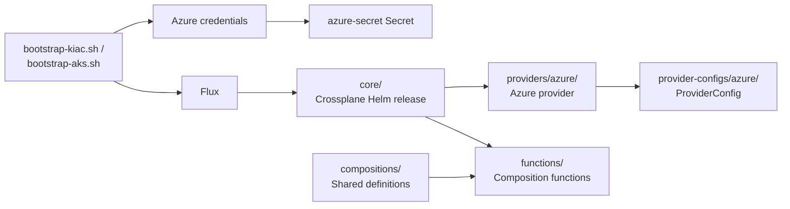

# Azure Crossplane Demo

Demo environment for managing Azure resources with Crossplane

> [!CAUTION]
> This repository is for demonstrations and workshops only. Do not use it in
> production. It grants broad Azure and Entra ID (Microsoft Graph)
> permissions, stores credentials locally,
> and does not provide the security, reliability, or operational hardening
> required for a production environment.

Flux watches [`clusters/local/`](clusters/local/) (a local [kiac](https://github.com/saiyam1814/kiac)
cluster) and [`clusters/aks/`](clusters/aks/) (a real AKS cluster), both of
which include the shared [`clusters/base/`](clusters/base/) Kustomization.
Other demo clusters can use their own overlay with `../base` while keeping
their generated `flux-system/` manifests and bootstrap path separate.
Crossplane is installed from [`clusters/base/crossplane/`](clusters/base/crossplane/):

```mermaid
flowchart LR
   Bootstrap["bootstrap-kiac.sh /<br/>bootstrap-aks.sh"] --> Credentials["Azure credentials"]
   Credentials --> Secret["azure-secret Secret"]
   Bootstrap --> Flux["Flux"]
   Flux --> Core["core/<br/>Crossplane Helm release"]
   Core --> Provider["providers/azure/<br/>Azure provider"]
   Provider --> Config["provider-configs/azure/<br/>ProviderConfig"]
   Core --> Functions["functions/<br/>Composition functions"]
   Compositions["compositions/<br/>Shared definitions"] --> Functions
```

- [`core/`](clusters/base/crossplane/core/) installs Crossplane through Helm.
- [`providers/azure/`](clusters/base/crossplane/providers/azure/) installs the Azure provider packages, including `provider-azuread` for Entra ID.
- [`provider-configs/azure/`](clusters/base/crossplane/provider-configs/azure/) configures the provider with Azure credentials.
- [`functions/`](clusters/base/crossplane/functions/) installs the packages used by Compositions.
- [`flux-kustomizations/`](clusters/base/crossplane/flux-kustomizations/) defines the dependency order, so each stage starts only after its required CRDs are ready.
- [`infrastructure/bootstrap-kiac.sh`](infrastructure/bootstrap-kiac.sh) and
  [`infrastructure/bootstrap-aks.sh`](infrastructure/bootstrap-aks.sh) share
  their Azure/Flux logic via [`infrastructure/lib/common.sh`](infrastructure/lib/common.sh)
  and each create the Kubernetes `Secret` from a locally generated service
  principal before bootstrapping Flux. The service principal is Contributor
  on the subscription and gets the Microsoft Graph application permissions
  `Group.ReadWrite.All` and `User.Read.All` (admin consent required; the
  bootstrap warns and continues if it cannot grant them).
- Full convergence takes a few minutes after bootstrap. Watch it with `flux get kustomizations -A`, then run `./infrastructure/verify-crossplane.sh`.

> [!NOTE]
> Crossplane `CompositeResourceDefinition`s and `Composition`s live in the
> shared, top-level [`compositions/`](compositions/) directory, outside
> `clusters/base/`. They are grouped first by provider (`azure/`, `entraid/`) and then by
> composition, allowing multiple clusters to use the same definitions.
> [`compositions/azure/resourcegroup/`](compositions/azure/resourcegroup/) is a
> working example: an `XResourceGroup` in the `azure.platform.example.org` API
> group composing an Azure `ResourceGroup`.

## Documentation

- [Local cluster setup](apps/docs/docs/kiac.md) — a local cluster on macOS, fastest to set up.
- [AKS cluster setup](apps/docs/docs/aks.md) — a real Azure-hosted cluster meeting the [aks-desktop cluster requirements](https://github.com/Azure/aks-desktop/blob/main/docs/cluster-requirements.md).
- [Working with resources](apps/docs/docs/working-with-resources.md)
- [Troubleshooting](apps/docs/docs/troubleshooting.md)

## Documentation site

[`apps/docs/`](apps/docs/) is a Material for MkDocs site whose reference pages
are generated from the XRD schemas in `compositions/`, so they cannot drift
from the APIs the cluster actually serves.

It runs **in the cluster**, in the `documentation-site` namespace:

- On AKS it is published at `https://docs.demo.liasis.dev` through Envoy
  Gateway, with a Let's Encrypt certificate from cert-manager (DNS-01) and an
  A record written by external-dns.
- On the local kiac cluster only the Deployment and Service are applied —
  reach it with `kubectl port-forward -n documentation-site svc/docs-site
  8080:80`.

Pushing to `main` rebuilds the image in GitHub Actions and commits the new
immutable tag back into
[`apps/docs/deploy/base/deployment.yaml`](apps/docs/deploy/base/deployment.yaml),
which Flux then applies. See [`apps/docs/README.md`](apps/docs/README.md).

> [!IMPORTANT]
> The GHCR package is created private even though this repository is public.
> Make it public once in the package settings, or the pod cannot pull it.
