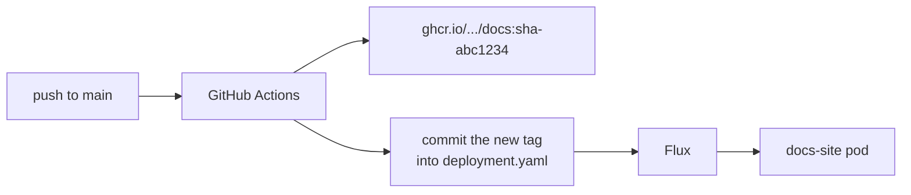

# Composition documentation site

> [!CAUTION]
> The documentation site is very experimental. It is 99% vibes, 1% brains, 0% QA
> The primary function is to show the importance of user friendly docs to make the crossplane compositions easier to use

A [Zensical](https://zensical.org/) site that documents the Crossplane
compositions in `compositions/`.

Zensical is the successor to Material for MkDocs, by the same authors. It
reads the same `mkdocs.yml` and keeps the Material look through its `classic`
theme variant.

Reference pages are **generated at build time** from the XRD and Composition
manifests, so they cannot drift from what the cluster actually serves. Nothing
generated is committed.

On an AKS cluster the site runs in the cluster itself, published at
<https://docs.demo.liasis.dev>. See [Running in the cluster](#running-in-the-cluster).

## Running locally

```sh
cd apps/docs
python3 -m venv .venv
./.venv/bin/pip install -r requirements.txt
./.venv/bin/python scripts/gen_pages.py
./.venv/bin/zensical serve
```

Then open <http://127.0.0.1:8000>.

Re-run `gen_pages.py` after changing an XRD, a `docs.yaml` or the page
template -- unlike the old `mkdocs-gen-files` setup, generation is a separate
step and `serve` will not redo it for you.

To check the build the way CI would:

```sh
./.venv/bin/python scripts/gen_pages.py
./.venv/bin/zensical build --strict
```

## How pages are generated

`scripts/gen_pages.py` is run **before** the build and writes real Markdown
files into `docs/reference/`:

| Module | Responsibility |
| --- | --- |
| `xrdoc/load.py` | Discover `compositions/**/xrd.yaml`, `composition.yaml`, `docs.yaml` |
| `xrdoc/schema.py` | Walk `openAPIV3Schema` into flat field rows and CEL rules |
| `xrdoc/render.py` | Render `templates/reference.md.j2` |

The sidebar comes from a generated `SUMMARY.md` via `literate-nav`.

`docs/reference/` and `docs/SUMMARY.md` are build output, regenerated on every
build and gitignored. Zensical does not support `mkdocs-gen-files`, which is
why generation is a separate step rather than a plugin.

## Adding a new composition

Nothing is needed — a new directory under `compositions/` containing an
`xrd.yaml` and a `composition.yaml` is picked up automatically.

Field flags are derived from the schema, so there is nothing to keep in sync:

| Flag | Comes from |
| --- | --- |
| **yes** in *Required* | the enclosing object's `required` list |
| `immutable` | an `x-kubernetes-validations` rule of `self == oldSelf` on the field |
| `nullable` | `nullable: true` |
| `unvalidated` | `x-kubernetes-preserve-unknown-fields: true` |

Marking a field immutable in an XRD is therefore all that is needed for the
badge to appear.

To add the prose the schema cannot supply, drop an optional `docs.yaml` next to
them:

```yaml
---
summary: One line, shown on the index and as the page lede.
stability: experimental
exampleRef: teams/crd-dev/network.yaml
exampleLines: "1-10"
exampleNotes: >-
  When and why to use this composition.
commonErrors:
  - symptom: What the user sees.
    cause: Why it happens.
    fix: What to do about it.
```

Every key is optional. `summary` and `exampleRef` are the two worth always
setting: the first is the only prose on the index page, and the second is what
makes the page copy-pasteable.

A `docs.yaml` is invisible to Flux: each composition's `kustomization.yaml`
lists `xrd.yaml` and `composition.yaml` explicitly.

## Running in the cluster

The site is deployed by Flux in the `documentation-site` namespace.

| Path | Applied on | Contains |
| --- | --- | --- |
| `deploy/base` | every cluster | Namespace, Deployment, Service |
| `deploy/aks` | AKS only | EnvoyProxy, Gateway, HTTPRoutes |

On the local kiac cluster there is no load balancer, public DNS zone or
reachable certificate authority, so only `deploy/base` is applied. View it
with:

```sh
kubectl port-forward -n documentation-site svc/docs-site 8080:80
```

On AKS the site is published at `https://docs.demo.liasis.dev`:

- **Envoy Gateway** terminates TLS and routes to the Service. The community
  `ingress-nginx` controller was retired in March 2026, so this repository
  uses Gateway API instead.
- **cert-manager** issues the certificate from Let's Encrypt using a DNS-01
  challenge against the `demo.liasis.dev` Azure DNS zone.
- **external-dns** writes the `docs.demo.liasis.dev` A record into that same
  zone, taking the address from the Gateway's status.

All three authenticate with the service principal created by
`infrastructure/bootstrap-aks.sh`, which also writes the per-environment
values (subscription, tenant, zone, hostname) into the `azure-dns-config`
ConfigMap that Flux substitutes into these manifests.

## How new content is published



`.github/workflows/docs-site.yaml` runs on every push to `main` that touches
`apps/docs/`, `compositions/` or `teams/`. It builds the image, pushes it to
GHCR with an immutable `sha-<commit>` tag, then commits that tag into
`deploy/base/deployment.yaml`. Flux applies the commit.

The cluster therefore never pulls a moving tag: every deployment corresponds
to exactly one commit, and rolling back is `git revert`.

> [!NOTE]
> The workflow's own commit is pushed with `GITHUB_TOKEN`, which deliberately
> does not trigger workflows, so there is no loop.

> [!IMPORTANT]
> The GHCR package is created **private**, even though this repository is
> public. Make it public once under
> *Packages → docs → Package settings → Change visibility*, or the pod will
> fail to pull with `ImagePullBackOff`. This cannot be set from the workflow.

## Building the image locally

The build context is the **repository root**, because the site is generated
from `compositions/` and the examples are included from `teams/`:

```sh
docker build -f apps/docs/Dockerfile -t docs-site:dev .
docker run --rm -p 8080:8080 docs-site:dev
```

### Serving on a different hostname

Everything the cluster applies takes the zone and hostname from
`infrastructure/config-aks.yaml`, so a fork only edits that one file — see
[DNS and certificates](../../docs/aks.md). The one exception is `site_url`,
which Zensical bakes into every canonical link and into `sitemap.xml` at build
time, long before Flux could substitute anything. It is a build argument
instead:

```sh
docker build -f apps/docs/Dockerfile \
  --build-arg DOCS_SITE_URL=https://docs.example.org/ -t docs-site:dev .
```

In CI the same value comes from the optional `DOCS_SITE_URL` repository
variable. Leave it unset to keep the default.
