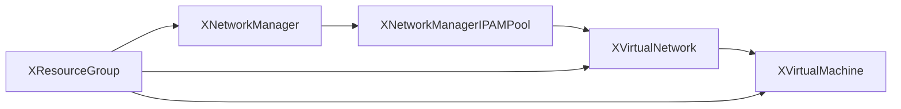

# Azure Crossplane Platform

Welcome. This cluster offers a small set of **self-service Azure APIs**. You
describe what you want in a few lines of YAML, commit it, and Crossplane
creates and keeps the real Azure resources in sync.

You never touch the Azure portal, an `az` command, or a Terraform state file.

## What you can create

| Composition | What it gives you |
| --- | --- |
| [XResourceGroup](reference/xresourcegroup.md) | A resource group to hold everything else |
| [XNetworkManager](reference/xnetworkmanager.md) | An Azure Virtual Network Manager |
| [XNetworkManagerIPAMPool](reference/xnetworkmanageripampool.md) | Automatic address-space allocation |
| [XVirtualNetwork](reference/xvirtualnetwork.md) | A virtual network with subnets and security groups |
| [XVirtualMachine](reference/xvirtualmachine.md) | A Linux or Windows virtual machine |

See the [reference overview](reference/index.md) for the full list.

## How it fits together

A typical team starts with a resource group, adds networking, and then places
workloads inside it:

Resources reference each other by **logical name**, not by Azure resource ID,
so you never copy long identifiers between manifests.

## Getting started

1. [Create your team namespace](teams.md) under `teams/`.
2. Add a manifest for the composition you want — every reference page starts
   with a working example you can copy.
3. Commit and push. Flux applies it, and Crossplane does the rest.

!!! note "These pages are generated"

    Every reference page is built directly from the
    `CompositeResourceDefinition` manifests in `compositions/`, so the field
    lists, defaults and validation rules always match what is actually
    deployed.

!!! warning "Experimental"

    This documentation site and the compositions it describes are
    demonstration material for a workshop, not a production platform.
