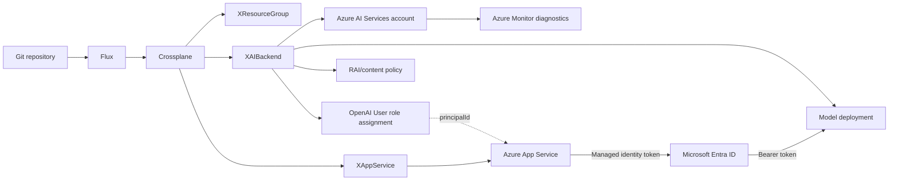

# Azure AI backend for the app hosting advisor

## Executive summary

The AI backend should no longer be selected or configured by the user. The
platform should provision one Azure-hosted model deployment, grant the
advisor's App Service identity permission to call it, and inject only the
non-secret endpoint and deployment name into the application.

The recommended first version is:

- A Microsoft Foundry-capable Azure AI Services account
  (`Microsoft.CognitiveServices/accounts`, `kind: AIServices`).
- One Azure OpenAI model deployment using a pay-as-you-go Standard or Global
  Standard deployment type.
- Direct calls from the existing App Service using its system-assigned managed
  identity and the `Cognitive Services OpenAI User` role.
- A new namespaced Crossplane composite such as `XAIBackend` that owns the
  account, deployment, content policy, and App Service role assignment.
- No model endpoint, deployment, provider, or API key fields in the browser UI.

Foundry is a good choice as the management and governance platform, but a
Foundry project or Foundry Agent Service is not required for this workload.
The deployable abstraction should be the underlying Azure AI Services account
and model deployment, because those are the inference resources with strong
Crossplane support and the smallest operational surface.[^1][^2]

Pricing was intentionally excluded from this report.

## Current-state problem

The advisor currently presents a model-connection form in the browser and
accepts provider, endpoint, deployment/model name, API key, and API version.
The backend stores that configuration only in the in-memory chat session and
sends the supplied key directly to the selected endpoint.[^3][^4] This conflicts
with the desired platform contract: choosing and securing the AI backend is an
infrastructure responsibility, not an end-user decision.

The deployed `XAppService` already supports a system-assigned identity, and
the repository already uses resource-scoped role assignments in `XKeyVault`.
The new AI backend can follow the same established pattern without introducing
a second credential-distribution system.[^5][^6]

## Recommendation

### Use Azure AI Services plus an Azure OpenAI model deployment

Provision an Azure AI Services account with:

- `kind: AIServices`
- A globally unique custom subdomain
- Local/key authentication disabled
- Public network access enabled for the initial demo, with managed identity
  authentication required
- One GA model deployment
- Default content filtering and Prompt Shields enabled
- A resource-scoped `Cognitive Services OpenAI User` assignment for the
  advisor App Service identity

`AIServices` is preferable to the narrower legacy `OpenAI` account kind because
it is the Foundry-capable superset and allows projects to be added later without
replacing the inference account. It still exposes the Azure OpenAI-compatible
chat-completions surface needed by the current application.[^7]

### Treat Foundry as the control plane, not another runtime hop

"Foundry" covers model catalog, deployment management, evaluation, safety,
projects, agents, and observability. The actual online inference deployment is
still represented by Azure Resource Manager resources beneath
`Microsoft.CognitiveServices/accounts` and
`Microsoft.CognitiveServices/accounts/deployments`.[^1][^2]

For this advisor, creating a Foundry project would add project-level RBAC and
another lifecycle surface without improving a single-app, single-model
request path. Foundry Agent Service would add thread/run orchestration and
persistent conversation concepts even though the application already owns the
interview state and requires deterministic structured output.[^8][^9]

Use the Foundry portal and evaluation facilities to select, test, and monitor
the model. Do not make a Foundry project or agent a required runtime dependency
until several applications need isolated projects, shared tools, or centralized
agent governance.

## Azure service comparison

| Option | Strengths | Limitations for this repository | Verdict |
|---|---|---|---|
| Azure AI Services/Azure OpenAI Standard deployment | Managed service, Azure OpenAI-compatible API, structured output, managed identity, content filters, low operations | Quota and model availability vary by region/deployment type | **Recommended** |
| Foundry project | Project-level organization, evaluation, assets, and RBAC | Extra resource and RBAC surface with no benefit for one app/model | Add later if multiple AI consumers require isolation |
| Foundry Agent Service | Managed agent threads, tools, and orchestration | Duplicates application-owned interview flow; different API and persistence model; structured-output constraints | Do not use for v1 |
| Provisioned Throughput | Predictable throughput and latency | Capacity planning and fixed reservation are unnecessary for the expected bursty demo workload | Revisit only after measured throttling/latency problems |
| Foundry serverless partner models | Broader vendor/model catalog behind managed endpoints | Capability consistency, structured output, and lifecycle differ by model provider | Optional future model portability path |
| Azure Container Apps serverless GPU | Scale-to-zero self-hosted OSS inference, managed identity, private networking | GPU quotas/regions, model image operations, cold starts, and GPU schema support must be managed | Only if open-weight/self-hosted models become a requirement |
| AKS GPU inference | Maximum control, broad GPU/model support, mature Kubernetes operations | Highest operational burden and slow infrastructure cold starts from zero | Not justified for this app |
| Azure ML managed online endpoint | Strong managed model deployment and traffic-splitting lifecycle | Always-on compute model and weak first-class Crossplane support for endpoints | Poor fit |
| App Service or Functions as model host | Familiar application hosting | App Service has no GPU; Functions GPU hosting is effectively Container Apps GPU | Use App Service only for the advisor application |

Azure Container Apps serverless GPU is the strongest self-hosted alternative
if the project later requires an open-weight model. It supports scale-to-zero
GPU workloads, but this trades a managed model API for responsibility over the
inference image, model loading, GPU quota, cold starts, and runtime
operations.[^10] AKS offers more GPU control but carries substantially more
cluster and node-pool operations.[^11]

## Proposed architecture



Runtime flow:

1. Flux applies the team resources.
2. Crossplane creates the Azure AI Services account and model deployment.
3. The App Service obtains a system-assigned identity.
4. `XAIBackend` grants that identity `Cognitive Services OpenAI User` scoped
   only to the AI account.
5. The App Service receives `AZURE_AI_ENDPOINT` and
   `AZURE_AI_DEPLOYMENT` as ordinary non-secret settings.
6. The application obtains a token for
   `https://cognitiveservices.azure.com/.default` through
   `DefaultAzureCredential` and calls the deployment without an API key.[^12]

## Proposed Crossplane contract

Create a namespaced `XAIBackend` under
`compositions/azure/ai-backend/`.

Suggested API:

```yaml
apiVersion: azure.platform.example.org/v1alpha1
kind: XAIBackend
metadata:
  name: appadvisor
spec:
  name: appadvisor
  accountName: ai-appadvisor-lsdev
  resourceGroupRef:
    name: app-hosting-advisor
  appServiceRef:
    name: appadvisor
  location: swedencentral
  deployment:
    name: advisor
    model:
      format: OpenAI
      name: <selected-ga-mini-model>
      version: <validated-version>
    sku:
      name: GlobalStandard
      capacity: <quota-allocation>
```

Suggested status:

```yaml
status:
  id: /subscriptions/.../providers/Microsoft.CognitiveServices/accounts/...
  endpoint: https://ai-appadvisor-lsdev.openai.azure.com
  deploymentName: advisor
```

The composition should create:

1. `cognitiveservices.azure.m.upbound.io/v1beta1 Account`
2. `cognitiveservices.azure.m.upbound.io/v1beta1 Deployment`
3. Optional `AccountRaiPolicy`
4. `authorization.azure.m.upbound.io/v1beta1 RoleAssignment`

The Upbound Azure provider exposes namespaced `Account`, `Deployment`,
`AccountRaiPolicy`, `AccountRaiBlocklist`, and `AccountProject` resources.
The `Deployment` contract includes model format/name/version, SKU/capacity,
RAI policy name, dynamic throttling, and version-upgrade behavior.[^13]

The role assignment should mirror the existing `XKeyVault` pattern, but use
the `Cognitive Services OpenAI User` role and scope it to
`account.status.atProvider.id`.[^5][^14]

### Provider and bootstrap changes

The repository does not currently install the Cognitive Services provider or
activate its managed resource definitions.[^15] The implementation requires:

- Add `provider-azure-cognitiveservices` using the same pinned provider family
  version and `azure-provider` runtime config as the existing Azure packages.
- Add `accounts.cognitiveservices.azure.m.upbound.io` and
  `deployments.cognitiveservices.azure.m.upbound.io` to the managed resource
  activation policy.
- Add `accountraipolicies.cognitiveservices.azure.m.upbound.io` if a custom RAI
  policy is composed.
- Register `Microsoft.CognitiveServices` during both AKS and kiac bootstrap.
- Continue using the existing `ClusterProviderConfig default`,
  `azure-secret`, and `azure-platform-config` configuration.

Crossplane coverage is sufficient for the account, deployment, RAI policy,
network private endpoint, and role assignment. Azure Monitor diagnostic
settings are available through the Azure insights provider if diagnostics are
included in the first iteration.[^13]

## Application changes

Remove the entire browser model-configuration step:

- Delete the provider selector.
- Delete endpoint, model, API key, and API-version inputs.
- Delete `ConfigureRequest` and the session `/configure` endpoint.
- Remove `ModelConfig.provider`, `ModelConfig.api_key`, and the generic
  OpenAI-compatible endpoint branch.
- Remove the per-session `config` requirement.

At process startup, require:

```text
AZURE_AI_ENDPOINT
AZURE_AI_DEPLOYMENT
```

These values are not secrets and can be injected by the platform. Authentication
should use `azure-identity`:

```python
credential = DefaultAzureCredential()
token_provider = get_bearer_token_provider(
    credential,
    "https://cognitiveservices.azure.com/.default",
)
```

The app should fail startup or readiness when either setting is absent. This is
preferable to showing a user-facing setup form because a missing backend is now
an infrastructure fault.

Keep `/health` as liveness and add readiness that verifies configuration and
token acquisition. Azure role assignments can take several minutes to
propagate, so the service should not report ready for chat while inference
authorization still fails.[^12]

## Model-selection policy

Do not permanently encode a volatile model name into application logic. Pin
the deployment model/version in the team infrastructure and evaluate upgrades
before changing it.

Choose:

- A GA mini-class model from the current reasoning-capable GPT family.
- A model/version explicitly supporting Structured Outputs.
- Low or minimal reasoning effort for the bounded architecture-selection task.
- A deployment type available in the required geography.

Replace the current loose `json_object` response mode with strict Structured
Outputs using a JSON Schema. Structured Outputs guarantee schema adherence,
while JSON mode guarantees only valid JSON. Azure documents schema constraints
including required properties, `additionalProperties: false`, nesting limits,
and a supported subset of JSON Schema.[^16]

Maintain a small evaluation set containing:

- Complete application descriptions
- Missing-information interviews
- Ambiguous hosting choices
- Prompt-injection attempts
- Expected Crossplane pattern selection
- Expected schema-valid recommendation
- Unsupported-resource requests

Run the same evaluation set before changing the deployed model version.
Foundry supports groundedness, relevance, task adherence, and tool-call
accuracy evaluation patterns, and model retirement follows a published
lifecycle that requires planned replacement testing.[^17][^18]

## Security and networking

### Authentication

Use managed identity exclusively. Disable local/key authentication on the AI
account. Key Vault should continue storing the GitHub OAuth secret, but it
should not store an Azure AI API key because no AI key is required.[^12]

### Authorization

Grant only `Cognitive Services OpenAI User` to the App Service identity,
scoped to the single AI account. Do not grant Contributor roles to the
runtime identity.[^14]

### Content safety

Keep Azure's default content filters enabled and enable Prompt Shields for
user prompts. The advisor's system prompt and deterministic renderer remain
the primary controls; content safety provides defense in depth against direct
prompt-injection attempts.[^19]

### Data handling

Microsoft states that prompts, completions, embeddings, and training data are
not made available to other customers or OpenAI and are not used to improve
foundation models without permission. Deployment type affects the geographic
processing boundary, so use regional or Data Zone deployment when residency
requirements prohibit Global processing.[^20]

### Networking

For the experimental version, a public AI endpoint protected by Entra ID and
`localAuthEnabled: false` is the pragmatic baseline.

Private endpoint should be a later hardening phase because it also requires:

- App Service regional VNet integration for outbound access
- Private DNS for the AI account
- Network ACL changes
- Additional network composition surfaces not currently modeled by
  `XAppService`

Selected networks or private endpoint become appropriate when the advisor
handles regulated data or the environment requires explicit data-exfiltration
controls.[^21]

### Observability

Add Azure Monitor diagnostic settings so request, token-usage, throttling, and
latency telemetry is retained outside the resource's default metric window.
Resource logs are not persisted until a diagnostic setting is configured.[^22]

Do not add API Management initially. APIM's AI gateway becomes valuable when
multiple applications need centralized token limits, semantic caching,
multi-backend routing, or per-consumer observability. It adds little for one
App Service using direct managed-identity authentication.[^23]

## Implementation sequence

1. Install and activate the Cognitive Services Crossplane provider.
2. Register `Microsoft.CognitiveServices` in both bootstrap paths.
3. Add `XAIBackend`, composition documentation, render tests, and snapshots.
4. Provision an `Account`, `Deployment`, optional `AccountRaiPolicy`, and the
   App Service role assignment.
5. Add `XAIBackend` to `teams/app-hosting-advisor/infrastructure.yaml`.
6. Inject endpoint and deployment settings into `XAppService`.
7. Change the application to managed-identity authentication.
8. Remove the browser model-configuration step and generic endpoint support.
9. Add strict Structured Outputs and an evaluation dataset.
10. Add diagnostics and inference readiness checks.
11. Consider private networking after `XAppService` supports VNet integration.
12. Consider a Foundry project or APIM only when additional AI applications
    create a real isolation or governance requirement.

## Decision

**Use Foundry, but deploy it as an Azure AI Services account plus a directly
consumed Azure OpenAI model deployment.**

This gives the project the useful parts of Foundry—model catalog, evaluation,
safety, deployment governance, and future project extensibility—without adding
Agent Service or project abstractions that the current workload does not need.
It aligns with the repository's Crossplane and managed-identity patterns and
eliminates all end-user backend configuration.

## Confidence assessment

**High confidence**

- Managed identity with `Cognitive Services OpenAI User` is the appropriate
  runtime authentication design.
- Azure AI Services `Account` and `Deployment` are the correct first-order
  Crossplane resources.
- The user-facing provider/API-key configuration should be removed.
- Foundry Agent Service, AKS, and Azure ML online endpoints are unnecessarily
  complex for this application.
- The current provider and activation policy need Cognitive Services additions.

**Medium confidence**

- `kind: AIServices` is preferable to `kind: OpenAI` for future Foundry
  extensibility. It is supported by the provider, but exact feature behavior
  and regional availability should be validated in the target subscription.
- Global Standard is the best default deployment type absent residency
  requirements. Final selection depends on target-region model availability
  and organizational data-boundary rules.
- Custom RAI policy and diagnostics can be included in v1, but exact diagnostic
  category names should be verified against the deployed resource before
  implementation.

**Assumptions**

- The advisor remains a low-to-moderate traffic, text-only workload.
- A single centrally selected model is acceptable.
- The initial experiment may use a public AI endpoint protected by Entra ID.
- Model pricing is intentionally outside scope.
- The repository remains on the provider family/version observed at
  `sjovang/azure-crossplane-demo@4a774696`.

## Footnotes

[^1]: [Microsoft Foundry deployment overview](https://learn.microsoft.com/azure/foundry/concepts/deployments-overview)
[^2]: [Azure AI model deployment types](https://learn.microsoft.com/azure/ai-foundry/foundry-models/concepts/deployment-types)
[^3]: [apps/app-hosting-advisor/app/main.py:33-73](https://github.com/sjovang/azure-crossplane-demo/blob/4a774696e3abc770e768b18b7928c1dc92a1e5df/apps/app-hosting-advisor/app/main.py#L33-L73)
[^4]: [apps/app-hosting-advisor/app/advisor.py:57-176](https://github.com/sjovang/azure-crossplane-demo/blob/4a774696e3abc770e768b18b7928c1dc92a1e5df/apps/app-hosting-advisor/app/advisor.py#L57-L176)
[^5]: [compositions/azure/keyvault/composition.yaml:21-86](https://github.com/sjovang/azure-crossplane-demo/blob/4a774696e3abc770e768b18b7928c1dc92a1e5df/compositions/azure/keyvault/composition.yaml#L21-L86)
[^6]: [compositions/azure/appservice/xrd.yaml:63-89](https://github.com/sjovang/azure-crossplane-demo/blob/4a774696e3abc770e768b18b7928c1dc92a1e5df/compositions/azure/appservice/xrd.yaml#L63-L89)
[^7]: [AzureRM cognitive account resource](https://raw.githubusercontent.com/hashicorp/terraform-provider-azurerm/main/website/docs/r/cognitive_account.html.markdown)
[^8]: [Microsoft Foundry Agent Service overview](https://learn.microsoft.com/azure/foundry/agents/overview)
[^9]: [Azure OpenAI Structured Outputs](https://learn.microsoft.com/azure/ai-foundry/openai/how-to/structured-outputs)
[^10]: [Azure Container Apps serverless GPU overview](https://learn.microsoft.com/azure/container-apps/gpu-serverless-overview)
[^11]: [AKS GPU workload operations](https://learn.microsoft.com/azure/aks/best-practices-ml-ops)
[^12]: [Use Azure OpenAI without keys](https://learn.microsoft.com/azure/developer/ai/keyless-connections)
[^13]: [Crossplane Cognitive Services Account and Deployment types](https://github.com/crossplane-contrib/provider-upjet-azure/tree/df08c2f9d51920cc25a3ac3cf2e8ef24b401080c/apis/namespaced/cognitiveservices/v1beta1)
[^14]: [Azure AI and machine-learning built-in roles](https://learn.microsoft.com/azure/role-based-access-control/built-in-roles/ai-machine-learning)
[^15]: [clusters/base/crossplane/activation-policies/azure/managed-resource-activation-policy.yaml:1-39](https://github.com/sjovang/azure-crossplane-demo/blob/4a774696e3abc770e768b18b7928c1dc92a1e5df/clusters/base/crossplane/activation-policies/azure/managed-resource-activation-policy.yaml#L1-L39)
[^16]: [Structured Outputs JSON Schema requirements](https://learn.microsoft.com/azure/ai-foundry/openai/how-to/structured-outputs)
[^17]: [Foundry evaluation approach](https://learn.microsoft.com/azure/ai-foundry/concepts/evaluation-approach-gen-ai)
[^18]: [Microsoft Foundry model lifecycle and retirement](https://learn.microsoft.com/azure/ai-foundry/openai/concepts/model-retirements)
[^19]: [Prompt Shields and prompt-injection protection](https://learn.microsoft.com/azure/ai-foundry/openai/concepts/content-filter-prompt-shields)
[^20]: [Data, privacy, and security for models sold by Azure](https://learn.microsoft.com/azure/foundry/responsible-ai/openai/data-privacy)
[^21]: [Configure Azure OpenAI networking](https://learn.microsoft.com/azure/ai-foundry/openai/how-to/network)
[^22]: [Monitor Azure OpenAI](https://learn.microsoft.com/azure/ai-foundry/openai/how-to/monitor-openai)
[^23]: [AI gateway capabilities in Azure API Management](https://learn.microsoft.com/azure/api-management/genai-gateway-capabilities)
